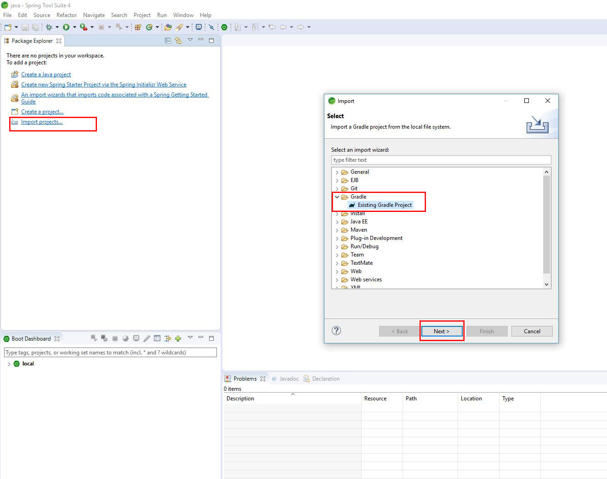
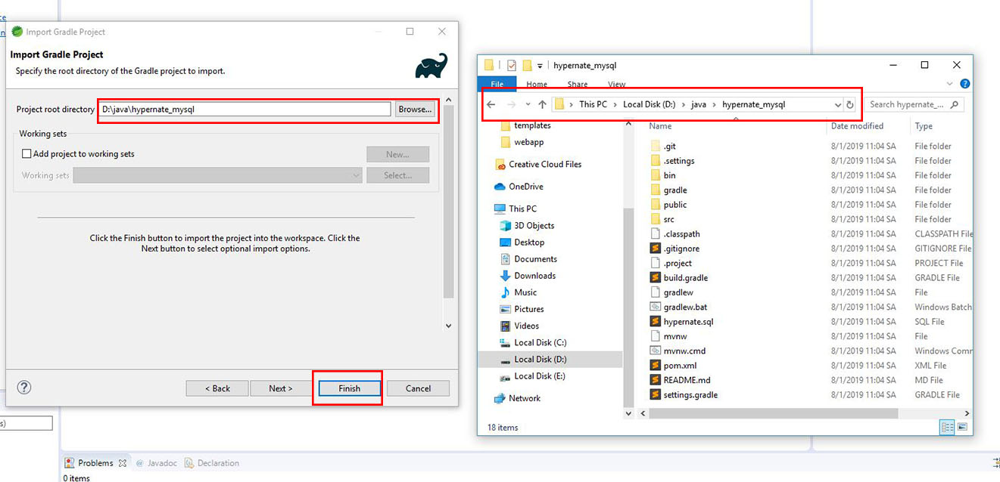
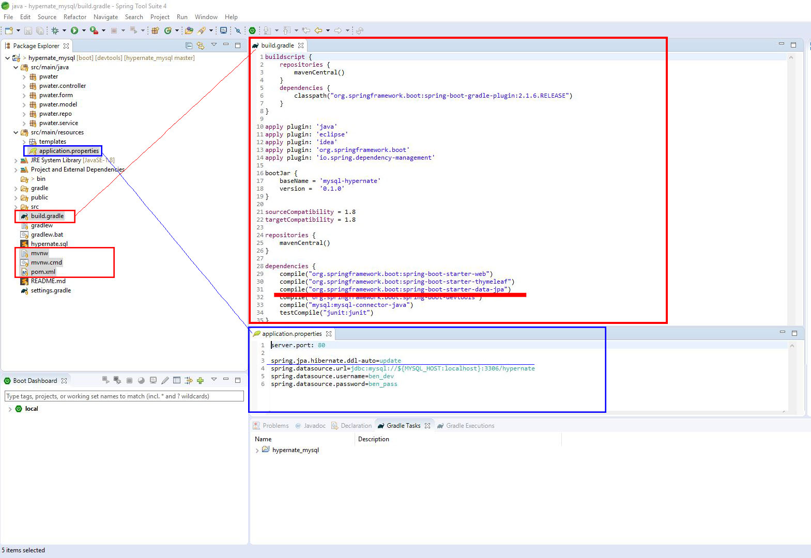
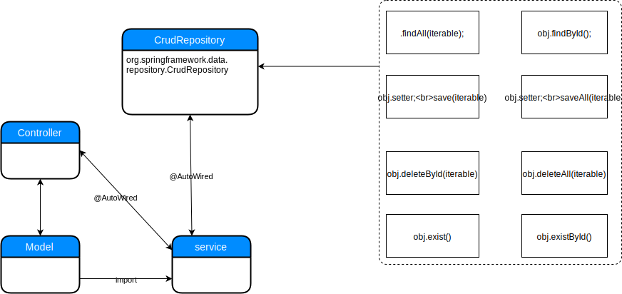

# Overview
*	[Import application](#markdown-header-import-application)
*	[Hibernate required](#markdown-header-hibernate-required)
*	[hibernate flow](#markdown-header-hibernate-flow)
*	[App flow](#markdown-header-app-flow)

# Import application

git clone https://Lampart_Thai_Huy_Binh@bitbucket.org/Lampart_Thai_Huy_Binh/hypernate_mysql.git 

+		Clone git source into folder.
+		Open __Spring tool suite__ select workspace is *hypernate_mysql*'s parent folder path.
+		On IDE screen select __Import__.
+		On __Import__ tab > choose __Gradle/Existing Gradle Project__ then click __Next__ in two times.
+		On __Import Gradle Project__ tab at __project root directory__ bar click __Browse..__
+		Select *hypernate_mysql* folder path which you just extract git url then click Finish as below picture.

# Hibernate required

+		On build.gradle need __compile("org.springframework.boot:spring-boot-starter-data-jpa")__
+		On application.properties need __spring.jpa.hibernate.ddl-auto=update__
+		On root folder need mvnw,mvnw.cmd,pom.xml for declare hypsernate and Mysql database source

# hibernate flow

# App flow

